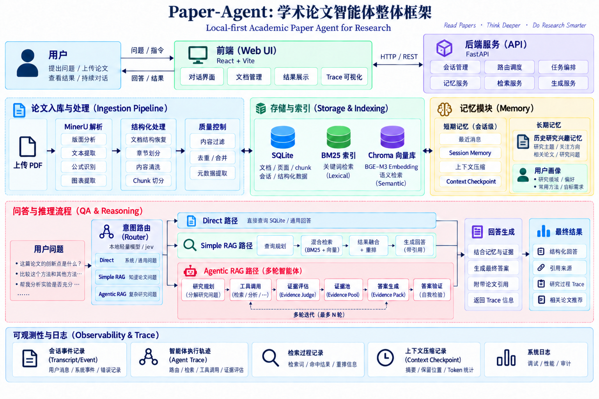
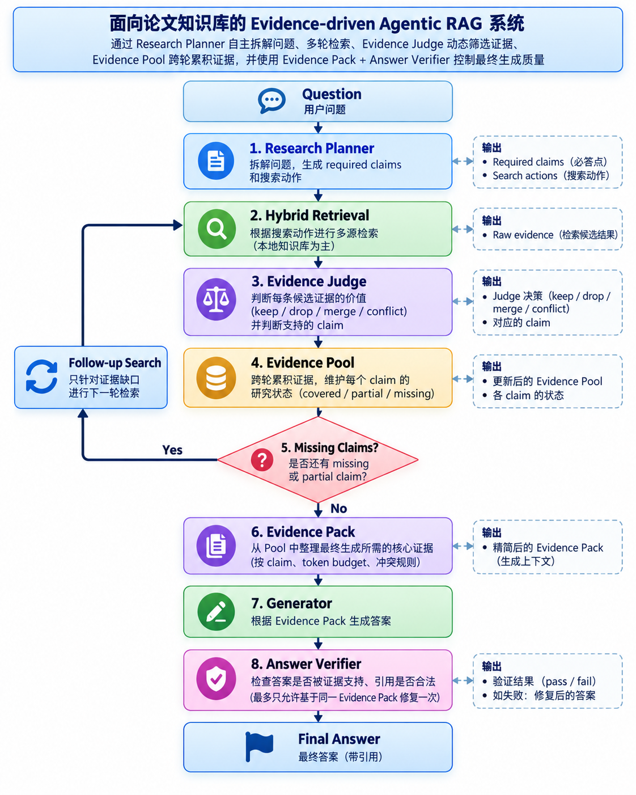

# Paper-Agent v2.1

> **可选本地模型或 Jev 路由的 Evidence-driven Agentic RAG**

Paper-Agent 是一个面向学术 PDF 的本地优先研究助手。它把 PDF 结构化解析、混合检索、证据管理和答案校验组织成一条可控的研究链路，并使用本地小模型或 Jev 判断每个问题应该直接处理、执行一次 RAG，还是进入多轮 Agentic RAG。

| 核心亮点 | 作用 |
| --- | --- |
| **可选意图 Router** | 默认使用随仓库发布的 Qwen3-1.7B Q4 本地模型，也可选择 Jev API |
| **三路按需执行** | 在 `direct`、`simple_rag`、`agentic_rag` 之间选择，避免所有问题都启动复杂 Agent |
| **Evidence-driven Agent Loop** | 围绕 claim 拆解、证据准入、覆盖状态和答案校验执行有边界的多轮研究 |
| **本地知识库** | MinerU、SQLite、BM25、BGE-M3、ChromaDB 与 BGE-Reranker 组成完整 PDF 入库和检索链路 |



## 意图路由（本地小模型/jev）

Router 根据当前问题和有限会话上下文输出一个意图，不负责生成答案或规划检索：

- `direct`：文档状态等无需检索的问题直接在本地处理。
- `simple_rag`：执行一次查询规划、混合检索、重排和基于证据的回答。
- `agentic_rag`：复杂比较、多对象分析和多跳问题进入 Agent 研究循环。

本地模式使用 `Qwen3-1.7B-Router-SFT-V3-Q4_K_M.gguf`，约 1.1 GB，通过 Git LFS 管理；启动器会用 llama.cpp 在 `127.0.0.1:8089` 托管它，无需 Router API Key。Jev 模式通过配置的 API 完成同样的三分类，且不启动本地 Router。两种模式下，Router 超时、协议错误或输出无效时都会保守地降级到 `agentic_rag`。

## Evidence-driven Agentic RAG

传统 RAG 通常在一次检索后直接生成答案。Paper-Agent 的 `agentic_rag` 会先明确需要回答的 claims，再围绕尚未覆盖的证据缺口迭代检索；只有整理出受控的 Evidence Pack 后才允许生成最终答案。



这条链路并不是把全部控制权交给 LLM：模型负责 claim 拆解、语义判断和答案生成，代码负责工具白名单、Schema 校验、Evidence Pool 状态更新、token 预算、引用合法性、超时与失败降级。默认最多执行 3 轮研究和 5 次工具调用，并受 180 秒总时限约束。

本发布版只包含运行代码和最终 Router 模型，不包含 `docs/`、`data/`、`reports/`、评估脚本、训练材料或预生成的 Chroma 数据库。

## 系统要求

- Windows x64
- Python 3.11（必须是 3.11）
- Git；选择本地 Router 时还需 Git LFS
- 至少 20 GB 可用空间
- 首次完整安装需要网络连接

## 完整安装

克隆时先跳过 Git LFS 自动下载，再选择 Router：

```powershell
$env:GIT_LFS_SKIP_SMUDGE="1"
git clone https://github.com/Zhenghao9103/Paper-Agent.git
Remove-Item Env:GIT_LFS_SKIP_SMUDGE
cd Paper-Agent
```

在项目根目录创建或编辑 `.env`，用 `ROUTER_PROVIDER` 选择 Router：

```dotenv
ROUTER_PROVIDER=local
```

可填 `local` 或 `jev`；没有 `.env` 或没有这一项时默认使用 `local`。安装时运行 `.\setup.ps1`，脚本会读取该配置。也可临时用 `.\setup.ps1 -RouterProvider jev` 覆盖 `.env`，并将所选模式写回 `.env`。

本地 Router 会下载约 1.1 GB 的 Q4 模型及 llama.cpp：

```powershell
git lfs install
.\setup.ps1
```

`setup.ps1` 会创建主环境和独立图表理解环境、安装依赖、下载并校验 BGE-M3、BGE-Reranker、MinerU 主模型、MinerU 图表模型及 tiktoken 缓存，并生成仅引用当前克隆目录的本地配置。选择本地 Router 时还会拉取最终 Q4 Router 和 llama.cpp。

`.mineru/`、`.hf-cache/` 和 `.cache/` 都由安装脚本生成；本地 Router 还会生成 `.tools/`。用户不需要手动下载或提交这些目录。所有外部资源的版本和校验信息记录在 `resources.lock.json`。

如选择 Jev，先将根目录 `.env` 中的配置改为：

```dotenv
ROUTER_PROVIDER=jev
JEV_API_KEY=your_api_key
JEV_BASE_URL=
JEV_MODEL=jev-1.13.0
```

然后运行安装脚本，无需下载本地 Q4 Router 和 llama.cpp：

```powershell
.\setup.ps1
```

Jev 模式仅省去 Router 模型与 llama.cpp，PDF 解析和检索所需模型仍照常安装。安装后改动 `.env` 的 `ROUTER_PROVIDER`，重启程序即可切换；若最初按 Jev 模式安装，切换回本地 Router 时还需运行 `.\setup.ps1` 下载本地 Router 资源。

## 配置模型服务

安装脚本会生成根目录 `.env`，并保留已存在的 API Key。至少配置用于回答和 Agentic RAG 的模型：

```dotenv
AGENT_API_KEY=your_api_key
AGENT_BASE_URL=https://your-provider.example/v1
AGENT_MODEL=your_model
```

本地 Router 无需远程 API Key。选择 Jev 时，在根目录 `.env` 填写 `JEV_API_KEY`。使用 TypeSafe 官方密钥时可将 `JEV_BASE_URL` 留空；使用 OpenCode Zen 等渠道时，还需填写对应的 `JEV_BASE_URL` 和 `JEV_MODEL`。`JUDGE_*` 仅用于开发期质量评估，发布版正常运行不需要配置。

## 启动与使用

```powershell
.\.venv\Scripts\python.exe main.py
```

浏览器默认打开 `http://127.0.0.1:8000`。如果不希望自动打开：

```powershell
$env:PAPER_AGENT_OPEN_BROWSER="0"
.\.venv\Scripts\python.exe main.py
```

上传 PDF 后会自动生成当前文档的 SQLite、BM25 和 Chroma 数据；仓库不提供也不需要预置 Chroma。文档状态只有在向量数量与内容校验完成后才会变为 `indexed`。

## 主要能力

- MinerU PDF 结构化解析、公式识别与图表理解
- SQLite 文档存储与 BM25 全文检索
- BGE-M3 向量召回、ChromaDB 本地索引和 BGE-Reranker 精排
- 可选本地 Qwen3-1.7B Q4 GGUF Router 或 Jev API
- `direct`、`simple_rag`、`agentic_rag` 三类按需问答路径
- Research Planner、Evidence Judge、Evidence Pool、Evidence Pack 与 Answer Verifier
- 工具预算、超时、Schema 校验、引用验证和安全轨迹记录
- 会话记忆与上下文压缩
- 内置 Web 界面及 React/Vite 前端源码

## 评估概览

开发阶段分别评估 Router、检索、回答生成与多轮 Agent。以下是固定数据集上的单次实验结果，不代表其他语料、设备或 API 时段的表现。

| 环节 | 数据与指标 | 结果 |
| --- | --- | --- |
| 意图 Router | 冻结的 60 题三分类集，每类 20 题；准确率、`agentic_rag` 召回率、请求耗时 | 本地 Q4：58/60、20/20，P50 799 ms、P95 1228 ms；Jev：59/60、20/20，P50 666 ms、P95 1480 ms |
| 检索 | 20 篇论文的黄金集；在 60 道可回答题上比较 Raw Fusion 与 Rewrite + Rerank | Hit@5：0.6167 → 0.8000；严格 Chunk Recall@5：0.3619 → 0.5369 |
| 回答生成 | 固定同一批 Top-5 证据，40 道可回答题加 10 道证据不足题；逐主张核验 | 本次 GLM-5.2 实验：Factual Correctness F1 0.9198、Faithfulness 1.0000、引用有效率 100%、拒答 10/10、P50 2.71 s |

本地 Router 与 Jev 的耗时来自各自独立运行，不能据此断定一种方式普遍更快。回答生成结果使用人工逐主张复核与本地指标，不是 Router 或 Agent 全链路分数。另有 20 段、共 80 轮的多轮 Agent 黄金集；现有端到端门槛运行的 Judge 覆盖率为 0，暂不报告其回答质量分数。黄金集原题、逐题输出和论文解析内容未随发布版公开。

## 目录说明

```text
backend/             FastAPI 后端、解析、检索与 Agent 代码
frontend/            React/Vite 前端源码与已构建静态资源
models/router/       唯一随仓库发布的 Q4 Router（Git LFS）
scripts/             安装、安装后检查与发布审计脚本
resources.lock.json  外部资源版本锁
setup.ps1            Windows 完整安装入口
```

以下均为运行时生成并被 Git 忽略的目录：`.mineru/`、`.tools/`、`.hf-cache/`、`.cache/`、`chroma/`、`storage/`、`backend/data/`。

## 常见问题

- `Git LFS resource mismatch`：确认已安装 Git LFS，然后运行 `git lfs pull`。
- 可用空间不足：清理磁盘后重新运行 `setup.ps1`；已校验完成的资源会被复用。
- 外部资源下载中断：直接重跑 `setup.ps1`，临时文件不会替换已完成资源。
- API 无法生成回答：检查 `.env` 中 `AGENT_API_KEY`、`AGENT_BASE_URL` 与 `AGENT_MODEL`。

## License

[MIT](LICENSE)
